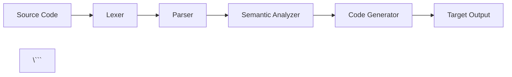

# GitBook Setup & Publishing Guide

This guide explains how to publish your Konfiguru learning journey to GitBook for a beautiful, searchable documentation experience.

---

## 📚 What is GitBook?

GitBook transforms your Markdown files into beautiful, searchable documentation with:
- **Professional appearance** - Clean, modern UI
- **Easy navigation** - Automatic sidebar from SUMMARY.md
- **Full-text search** - Find content instantly
- **Mobile-friendly** - Responsive design
- **Versioning** - Track documentation changes
- **Analytics** - See what people read most

**Perfect for progressive learning paths like Konfiguru!**

---

## 🚀 Quick Setup (10 minutes)

### Step 1: Create GitBook Account

1. Go to [gitbook.com](https://www.gitbook.com/)
2. Sign up with GitHub (recommended for auto-sync)
3. Verify your email

### Step 2: Create a New Space

1. Click "New Space" in GitBook dashboard
2. Choose "Import from Git"
3. Select your Konfiguru GitHub repository
4. Choose the `main` branch

### Step 3: Configure Structure

GitBook will automatically detect:
- `README.md` as your landing page
- `SUMMARY.md` as your table of contents
- `.gitbook.yaml` for configuration

**That's it!** Your docs are live.

---

## 📋 Repository Structure

Your repository is already configured for GitBook:

```
konfiguru/
├── .gitbook.yaml           # GitBook configuration
├── README.md               # Landing page (main overview)
├── SUMMARY.md              # Table of contents (auto-generated sidebar)
├── guides/                 # Getting started guides
│   ├── quick-start.md
│   ├── learning-path-overview.md
│   └── how-to-use.md
├── foundations/            # Level 1 (Months 1-6)
│   ├── phase-1-overview.md
│   ├── month-01/
│   │   ├── README.md
│   │   ├── week-1.md
│   │   └── daily/
│   │       └── Day-001.md → Day-030.md
│   └── ...
├── intermediate/           # Level 2 (Months 7-12)
│   └── ...
├── advanced/              # Level 3 (Months 13-18)
│   └── ...
├── expert/                # Level 4 (Months 19-24)
│   └── ...
├── reference/             # Deep dive technical content
│   ├── compiler-theory/
│   ├── iac/
│   └── ai-ml/
├── certifications/        # Cert study guides
│   ├── cka/
│   ├── aws-saa/
│   ├── terraform/
│   └── cks/
└── appendix/
    ├── glossary.md
    ├── resources.md
    └── faq.md
```

---

## ⚙️ Configuration Details

### .gitbook.yaml Explained

```yaml
root: ./

structure:
  readme: README.md       # Main landing page
  summary: SUMMARY.md     # Sidebar navigation

redirects:
  # Maps old paths to new structure
  # Ensures links don't break when restructuring
```

### SUMMARY.md Structure

The SUMMARY.md file creates your sidebar navigation with:
- **Progressive levels** (Foundation → Expert)
- **Clear hierarchy** (Part → Phase → Month → Week → Day)
- **Role-based organization** (Staff Engineer → Principal Engineer)

**GitBook best practices followed:**
- Max 2-3 levels of nesting
- Clear section separators (`---`)
- Descriptive titles with context
- Reference materials separated from learning path

---

## 🎨 Customization Options

### GitBook Space Settings

After setup, customize in GitBook dashboard:

**1. Appearance**
- Choose theme (light/dark/auto)
- Customize colors to match your brand
- Upload logo and favicon

**2. Navigation**
- Enable/disable breadcrumbs
- Configure sidebar behavior
- Set up page groups

**3. Integrations**
- Google Analytics
- Intercom/Discord chat widget
- Custom domain (e.g., docs.konfiguru.dev)

**4. Features**
- Search customization
- Page ratings
- Git sync options
- Export formats (PDF, Markdown)

---

## 🔄 Auto-Sync with GitHub

### One-Time Setup

1. In GitBook, go to Space Settings → Integrations
2. Connect to GitHub
3. Enable "Bi-directional sync"
4. Choose branch (usually `main`)

### How It Works

**GitHub → GitBook:**
- Push to GitHub → GitBook auto-updates (5-10 min)
- Perfect for daily challenge updates

**GitBook → GitHub:**
- Edit in GitBook editor → Commits to GitHub
- Great for quick typo fixes

### Recommended Workflow

1. **Write content** in your local editor (VS Code, etc.)
2. **Commit to GitHub** when ready
3. **GitBook auto-publishes** within 10 minutes
4. **Review live** at your GitBook URL

---

## 📱 Mobile Experience

GitBook automatically optimizes for mobile:
- Responsive design
- Touch-friendly navigation
- Offline reading (PWA)
- Fast loading

Perfect for learning on the go!

---

## 🔍 Search Optimization

### Making Content Searchable

GitBook indexes all content automatically. Improve search by:

**1. Use Descriptive Headings**
```markdown
❌ Bad:  # Part 1
✅ Good: # Foundation Level (Months 1-6): Staff Engineer Path
```

**2. Add Keywords**
```markdown
**Keywords:** compiler, lexer, tokenization, Go, parsing
```

**3. Use Callouts**
```markdown

This section covers lexical analysis fundamentals

```

**4. Cross-Reference**
Link related content to improve discovery

---

## 📊 Analytics & Insights

### Track Learning Engagement

GitBook provides analytics on:
- **Page views** - Which months are most popular?
- **Search queries** - What are learners looking for?
- **Reading time** - How long per daily challenge?
- **Navigation paths** - Do people skip levels?

Use insights to:
- Improve popular content
- Add missing topics
- Adjust difficulty curves
- Identify pain points

---

## 🌐 Custom Domain (Optional)

### Setup Steps

1. **Purchase domain** (e.g., `learn.konfiguru.dev`)
2. **Add CNAME record** in DNS:
   ```
   learn.konfiguru.dev → <your-gitbook-space>.gitbook.io
   ```
3. **Configure in GitBook**:
   - Space Settings → Domain
   - Enter your custom domain
   - Verify DNS
4. **Enable HTTPS** (automatic via GitBook)

**Benefits:**
- Professional appearance
- Better SEO
- Brand consistency
- Shareable links

---

## 🎯 Best Practices for Progressive Learning

### GitBook-Specific Tips

**1. Use Page Groups**
Group related content (e.g., all Week 1 pages)

**2. Add Page Descriptions**
```markdown
---
description: Learn lexical analysis by building a tokenizer in Go
---
```
Shows in search results and previews

**3. Include Visuals**
```markdown

```
GitBook hosts images automatically

**4. Add Code Snippets**
```go
// Lexer example
func (l *Lexer) NextToken() Token {
    // Implementation
}
```
Syntax highlighting included

**5. Use Hints/Callouts**
```markdown

✅ You've completed Month 1! Take a day to celebrate before Month 2.

```

### Progressive Disclosure

Structure content for different reader types:

**Level 1: Overview** (in README.md)
- What you'll learn
- Time commitment
- Prerequisites

**Level 2: Weekly** (in week-N.md)
- Week goals
- Daily breakdown
- Resources

**Level 3: Daily** (in Day-NNN.md)
- Specific tasks
- Code examples
- Verification steps

**Level 4: Deep Dives** (in reference/)
- Theory
- Advanced topics
- Research papers

---

## 🚀 Publishing Workflow

### Daily Challenge Updates

```bash
# 1. Write today's challenge
vim "Problem Statements/01-Lox-Lexer-Go-Fundamentals/Day-001.md"

# 2. Commit to Git
git add "Problem Statements/01-Lox-Lexer-Go-Fundamentals/Day-001.md"
git commit -m "Add Month 1 Day 1: Go setup and lexer intro"
git push origin main

# 3. GitBook auto-syncs (5-10 min)
# ✅ Done! Content is live
```

### Monthly Releases

```bash
# 1. Complete all 30 days
# 2. Update month README with completion status
# 3. Add month to SUMMARY.md if not already there
# 4. Commit and push
git add .
git commit -m "Complete Month 1: Lox Lexer & Go Fundamentals"
git push origin main

# 5. Create GitHub release
git tag -a v1.0-month-1 -m "Month 1 Complete"
git push origin v1.0-month-1

# 6. Announce in community
# - Discord
# - Twitter
# - LinkedIn
```

---

## 🎨 Visual Enhancements

### Diagrams with Mermaid

GitBook supports Mermaid diagrams:

```markdown


### Tables for Comparisons

```markdown
| Feature | Konfiguru | YAML | HCL |
|---------|-----------|------|-----|
| Lines for simple app | 15 | 150+ | 80+ |
| Type safety | ✅ | ❌ | Partial |
| AI suggestions | ✅ | ❌ | ❌ |
```

### Progress Indicators

```markdown
**Phase 1 Progress:** ▓▓▓▓▓░░░░░ 50% (3/6 months)
```

---

## 📚 Example Pages

### Landing Page (README.md)

Should include:
- ✅ Clear value proposition
- ✅ Visual learning path
- ✅ Quick start CTA
- ✅ Success metrics
- ✅ Community links

### Monthly Overview (month-XX/README.md)

Should include:
- ✅ Month goals
- ✅ Weekly breakdown
- ✅ Prerequisites
- ✅ Deliverables
- ✅ Time estimates
- ✅ Success criteria

### Daily Challenge (Day-XXX.md)

Should include:
- ✅ Learning goal (1-2 sentences)
- ✅ Tasks (3-5 specific)
- ✅ Code examples
- ✅ Verification steps
- ✅ Resources
- ✅ Navigation (prev/next)

---

## 🔧 Troubleshooting

### Common Issues

**Q: GitBook not syncing from GitHub**
A: Check GitHub integration in Space Settings. Re-authorize if needed.

**Q: SUMMARY.md not showing all pages**
A: Ensure all links in SUMMARY.md are valid file paths (not broken links)

**Q: Images not displaying**
A: Use relative paths (`./images/pic.png`) not absolute paths

**Q: Code blocks not highlighting**
A: Specify language (```go, ```yaml, etc.)

**Q: Search not finding content**
A: GitBook reindexes on every sync. Wait 10-15 minutes after push.

---

## 📈 Success Metrics

Track these metrics to improve your docs:

### Week 1
- ✅ GitBook space published
- ✅ README.md live and looking good
- ✅ SUMMARY.md navigation works
- ✅ First 3 days of Month 1 published

### Month 1
- ✅ All 30 days of Month 1 published
- ✅ Custom domain configured (optional)
- ✅ Analytics enabled
- ✅ First external visitor

### Month 3
- ✅ 90 days published (3 months)
- ✅ Search analytics reviewed
- ✅ Most popular pages identified
- ✅ Community feedback incorporated

### Month 12
- ✅ All 12 months published
- ✅ 100+ unique visitors
- ✅ Reference materials complete
- ✅ Certification guides added

### Month 24
- ✅ Complete learning path live
- ✅ 1000+ unique visitors
- ✅ Community contributions
- ✅ Used by others successfully

---

## 🤝 Community Integration

### Discord Widget

Add to GitBook:
```html
<iframe src="https://discord.com/widget?id=YOUR_SERVER_ID"
        width="350" height="500" allowtransparency="true"
        frameborder="0" sandbox="allow-popups allow-popups-to-escape-sandbox allow-same-origin allow-scripts">
</iframe>
```

### GitHub Discussions

Link from GitBook pages:
```markdown
**Questions?** Ask in [GitHub Discussions](https://github.com/yourusername/konfiguru/discussions)
```

### Social Media

Add sharing buttons in GitBook settings

---

## 🎯 Next Steps

### Immediate (Today)
1. [ ] Create GitBook account
2. [ ] Connect GitHub repository
3. [ ] Verify README.md displays correctly
4. [ ] Test navigation via SUMMARY.md
5. [ ] Share URL with one friend

### This Week
1. [ ] Publish first 5 days of Month 1
2. [ ] Customize theme colors
3. [ ] Add custom domain (optional)
4. [ ] Enable analytics

### This Month
1. [ ] Complete Month 1 (30 days)
2. [ ] Add certification guides
3. [ ] Create reference materials
4. [ ] Announce on social media

---

## 📚 Additional Resources

### GitBook Docs
- [Official Documentation](https://docs.gitbook.com/)
- [Git Sync Guide](https://docs.gitbook.com/integrations/git-sync)
- [Markdown Guide](https://docs.gitbook.com/getting-started/markdown)
- [Customization Options](https://docs.gitbook.com/publishing/customization)

### Examples to Learn From
- [GitBook's Own Docs](https://docs.gitbook.com/)
- [Next.js Documentation](https://nextjs.org/docs)
- [Kubernetes Docs](https://kubernetes.io/docs/)

### Community
- [GitBook Community](https://community.gitbook.com/)
- [GitBook Twitter](https://twitter.com/gitbook)

---

## 🎉 Ready to Publish?

Your content is structured and ready for GitBook!

**Steps:**
1. Create GitBook account
2. Import GitHub repository
3. Verify SUMMARY.md navigation
4. Customize appearance
5. Share with the world!

**Your documentation will be live at:**
`https://your-space-name.gitbook.io/konfiguru/`

---

**Questions?** Check the [GitBook Documentation](https://docs.gitbook.com/) or ask in [Discussions](https://github.com/yourusername/konfiguru/discussions).

Good luck! 🚀

---

*Last Updated: 2024-11-15*
*Maintained by: Konfiguru Learning Journey Team*
